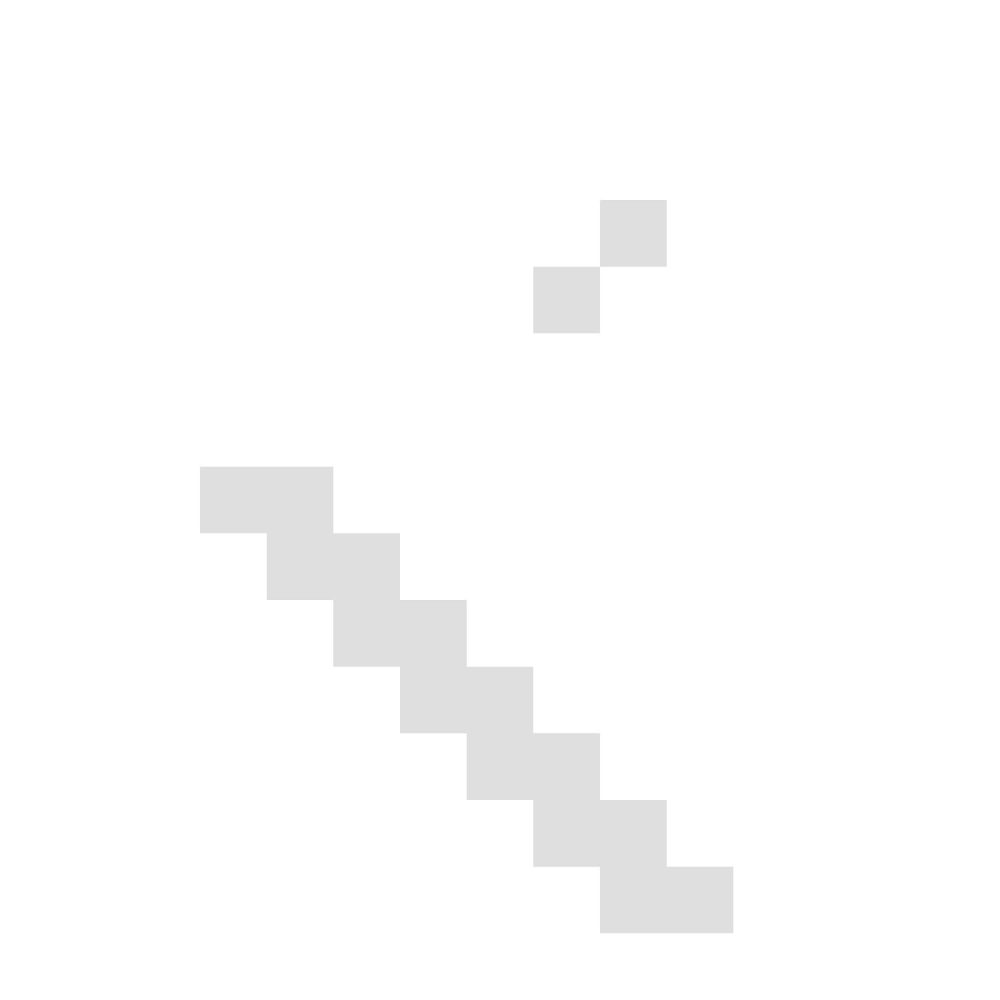
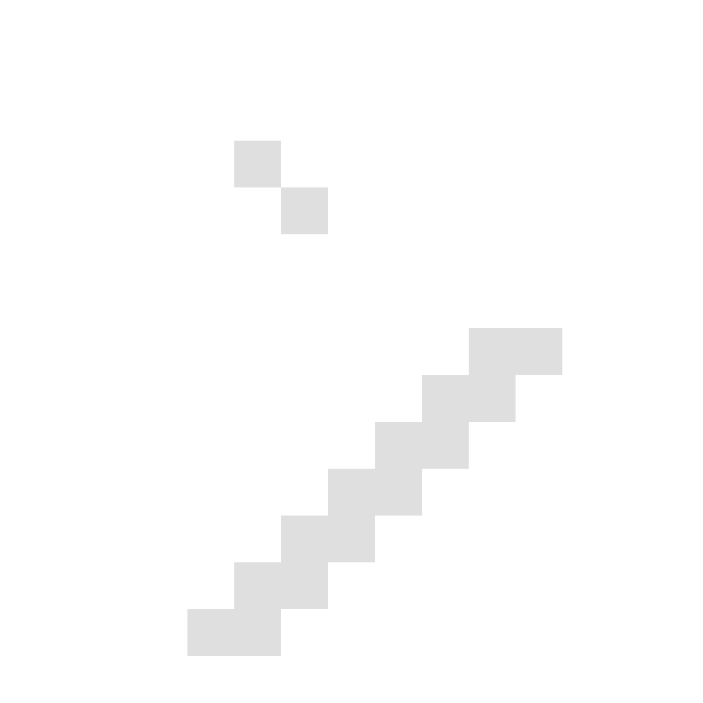

# @pixel/icons

[](https://www.npmjs.com/package/@pixel/icons)
[](https://travis-ci.org/cadgerfeast/pixel-icons)
[](https://www.npmjs.com/package/@pixel/icons)
[](https://coveralls.io/github/cadgerfeast/pixel-icons?branch=master)
[](https://github.com/cadgerfeast/pixel-icons/blob/master/LICENSE)

> Pixel icons & font sprite.

## Installation

``` bash
npm install --save @pixel/icons
```

## Quick look





See full icon list [here.](./ICONS.md "Full icon list")

## Usage

### Font

``` html
<link rel="stylesheet" href="@pixel/icons/fonts/PixelIcons.css">
<!-- CDN -->
<link rel="stylesheet" href="https://unpkg.com/@pixel/icons/fonts/PixelIcons.css">
<!-- Usage -->
<span class="pi pi-home"></span>
```

### Icons

Icons are also available as standalone files under multiple resolutions:

* `png-15`: 15px
* `png-150`: 150px
* `png-1500`: 1500px
* `svg`: 150px

``` html
<!-- Usage -->


```

## Contributors

<table>
  <tbody>
    <tr>
      <td align="center">
        <a href="https://github.com/cadgerfeast">
          
          <br/>
          <span>cadgerfeast</span>
        </a>
      </td>
    </tr>
  </tbody>
</table>

## License

MIT
